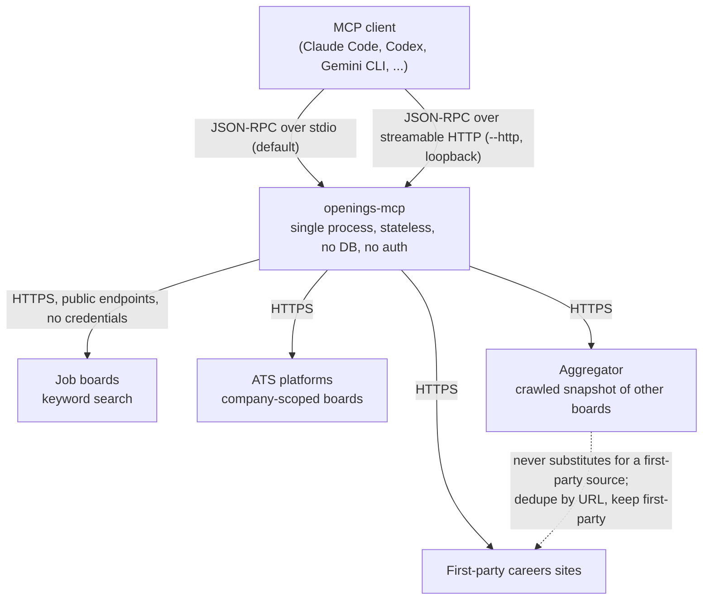

# Architecture

For people changing openings-mcp, not people using it. README covers use.
Gives the bird's eye view only. Stays coarse-grained on purpose. Anything
that changes when a provider is added belongs in code, not here.

## Bird's eye view

openings-mcp is a single stateless process. Exposes job search as MCP tools.
Owns no data. Every tool call becomes one or more HTTPS requests to a public
upstream endpoint. Response renders as text for the calling model. No
database, no persistence, no authentication, no scraped job data in the repo.

Two tool families. Per-provider tools (`<provider>_search_jobs`,
`<provider>_get_job_detail`) front one upstream each. Unified company tools
(`search_jobs_by_company`, `get_filters_by_company`,
`get_job_detail_by_company`) take a company and hide which ATS serves it.
Both families use the same two-step flow. Search returns summaries carrying
an upstream-native identifier. Detail exchanges that identifier for the full
posting. Identifiers are never interchangeable across providers.

## Design decisions

### Mirror the upstream

For any one upstream, the tools expose what that upstream exposes: its search
parameters on input, its fields on output. No lowest common denominator.

The more a tool exposes, the more criteria a job seeker can match on, and the
more of the jobs that suit them they find. A lowest common denominator served
a human integrator, who had to write code against one fixed shape. The
consumer here is an LLM. It reads a shape it has never seen before and still
does something sensible with it, so there is nothing left to gain by cutting
fields. Mirroring also keeps the search experience consistent with the board
itself: the person searching already knows that board's vocabulary and
filters, so the tools answer the question they actually asked.

### One exception: ATS platforms

Company boards hosted on an ATS sit behind one unified interface, and which
ATS serves a company never surfaces in the tool schema. Nobody searches for a
job "on Workday": the ATS is the employer's vendor choice, and its name and
conventions mean nothing to a job seeker. A platform-wide board, or an
aggregator crawling many boards, is a job board and keeps its own mirrored
tools; a single employer's board goes behind the company tools.

### Describe the upstream in openapi.yaml

Integrating a third party starts with an `openapi.yaml` recording what that
upstream actually does. The client is generated from it.

What costs real effort is learning how a site behaves: which parameter it
honors, which it silently ignores, what an opaque token means. That knowledge
is the artifact worth keeping, and `openapi.yaml` is where it is kept. The
client is a build product — code is cheap, and regenerating it costs nothing.
Generating it also keeps an LLM off the correctness path: a hand-written
client drifts from the observed behavior and invents parameters that were
never there, while a generated one can only do what `openapi.yaml` declares.

Where a site exposes no API to describe, the same investigation is written
down in `doc.go` instead.
