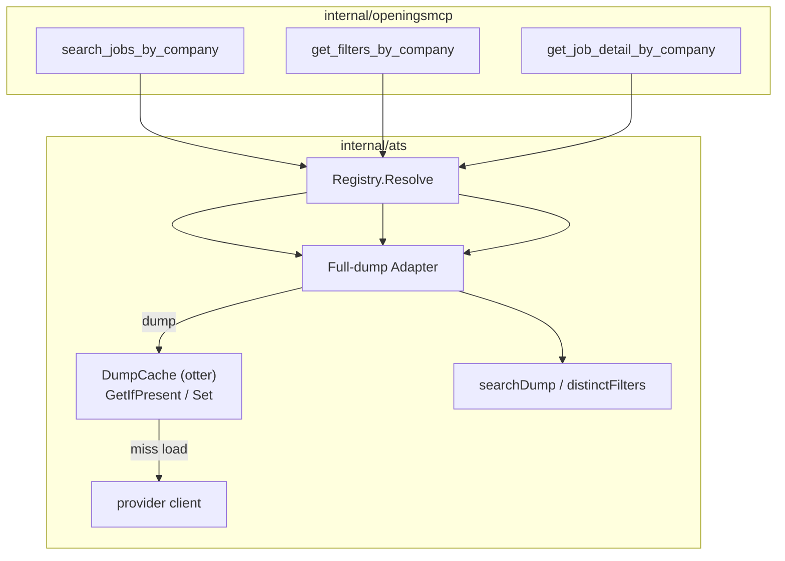

# Session-scoped dump cache for full-dump ATS adapters

| Field | Value |
|---|---|
| **Title** | Session-scoped dump cache for full-dump ATS adapters |
| **Author** | TBD |
| **Date** | 2026-07-29 |
| **Status** | Implemented |
| **Code** | `internal/ats/dump_cache.go`, full-dump adapters under `internal/ats/` |
| **Related** | [2026-07-06-unified-company-tools-design.md](2026-07-06-unified-company-tools-design.md) |

---

## Overview

Agent workflows against the unified company tools often issue several calls
against the same company in one session: `get_filters_by_company` →
`search_jobs_by_company` → page N → `get_job_detail_by_company`. Full-dump
adapters re-fetch the entire upstream board on every Search/Filters (and some
Detail paths). That multiplies expensive upstream requests inside a single
agent turn.

This feature adds a **process-local, short-TTL cache of intermediate
`[]dumpJob` values** in `internal/ats`, keyed by `(adapter name, slug)`.

**Shipped defaults**

| Concern | Value |
|---|---|
| Backend | [`github.com/maypok86/otter/v2`](https://github.com/maypok86/otter) |
| Path | `GetIfPresent` → `load(ctx)` → `Set` → return clone |
| Default TTL | **10 minutes** (`DefaultDumpCacheTTL`) |
| Disable | **`--dump-cache-ttl=0`** → main passes **nil** cache (no `Enabled` flag) |
| Memory | **MaximumSize = 100** boards (`DefaultDumpCacheMaxEntries`) |
| Coalescing | **None** — single-user stdio MCP (~1–2 QPS) |
| Cancellation | Caller’s `ctx` passed straight to upstream load |
| Dump contract | Returned `[]dumpJob` is **read-only**; mutators (e.g. BambooHR enrich) must `cloneDumpJobs` first |
| Wiring | **Injected** `*DumpCache` into full-dump adapters (no package global / atomic) |

Provider packages stay pure. The public `Adapter` interface is unchanged.

The historical “no cache / fully stateless” invariant is revised to: **no
durable or cross-process cache; optional short-TTL in-process dump cache for
the full-dump family.** See the unified-company-tools design for the updated
bullet.

---

## Goals & non-goals

### Goals

1. Cache full-board intermediate dumps (`[]dumpJob` + optional side payload)
   so Filters → Search → page → dump-based Detail reuses one upstream load.
2. Stay in `internal/ats` only; do not put cache inside `internal/provider/*`.
3. Bound memory with a simple max entry count (100 company boards by default).
4. Expose a single CLI duration flag for TTL / disable.
5. Keep adapter tests isolated via `TestMain` (global cache off in tests).

### Non-goals

- Stampede / singleflight coalescing (not needed at 1–2 QPS stdio).
- Caching server-side search adapters (Workday, SmartRecruiters, …).
- Caching residual `searchDump` over server-narrowed candidate sets
  (Workable / SmartRecruiters / MokaHR).
- Cross-process or durable cache.
- Env-var configuration (CLI flags only).
- Changing MCP tool schemas or the public `Adapter` interface.

---

## Key decisions

| # | Decision | Rationale |
|---|---|---|
| K1 | Cache in `internal/ats`, not providers | Pure clients/rosters |
| K2 | Value = `[]dumpJob` + optional side, not search pages | One dump serves Filters/Search/Detail |
| K3 | Key = `(adapter.Name(), slug)` | Cross-ATS slug isolation |
| K4 | Default TTL **10m**, process-local | Session reuse; short freshness window |
| K5 | Disable by not constructing / inject **nil** | CLI: `--dump-cache-ttl<=0` → nil; no `Enabled` on config |
| K6 | No public `Adapter` change | Registry/MCP stable |
| K7 | Thin wrap of private `dump()` via `getOrLoadDump` | One pattern for 11 adapters |
| K8 | Clone on every return | BambooHR enrich must not poison cache |
| K9 | Ashby / Teamtailor Detail via dump | Otherwise Detail always misses |
| K10 | Herp board as side payload | Detail needs company section + URL policy |
| K11 | Otter **MaximumSize 100** | Enough for a research session; no byte weigher |
| K12 | **No** stampede coalescing | Single-user stdio; keep get/load/set simple |
| K13 | Inject `*DumpCache` at adapter construction (`nil` = no cache) | No global/atomic; tests pass `nil` |
| K14 | Server-side family out of scope | Low hit rate |

---

## Design

### Architecture



### Path (`(*DumpCache).getOrLoadDump`)

```text
if c == nil: return load(ctx)
key = provider + ":" + slug
if hit := GetIfPresent(key): return hit.jobs, hit.side   // read-only
jobs, side, err := load(ctx)   // caller's ctx
if err: return err
Set(key, {jobs, side})         // take ownership of load result
return jobs, side              // same slice; still read-only
```

Returned dumps are **read-only** (see `dumpJob` contract). Callers that must
mutate (BambooHR description enrich) call `cloneDumpJobs` first.

No package global, no stampede machinery, no clone-on-return.

### Storage (otter)

```go
otter.Options[string, *dumpCacheEntry]{
    MaximumSize:      DefaultDumpCacheMaxEntries, // 100 boards
    ExpiryCalculator: otter.ExpiryWriting(ttl),   // default 10m
}
```

`dumpCacheEntry` holds `jobs []dumpJob` (owned, cloned at store) and optional
`side any` (read-only; Herp uses `*herp.CompanyBoard`).

### Config / CLI

| Surface | Behavior |
|---|---|
| `--dump-cache-ttl` | Default `10m`. Duration `<=0` disables cache |
| `DumpCacheConfig.TTL` | Positive duration; `<=0` becomes default 10m if constructed |
| `DumpCacheConfig.MaxEntries` | Default 100 if <=0 |
| Env vars | None |

Construct only when wanted; inject into full-dump adapters:

```go
var dumpCache *ats.DumpCache
if ttl := *dumpCacheTTL; ttl > 0 {
    dumpCache = ats.NewDumpCache(ats.DumpCacheConfig{TTL: ttl})
}
// NewGreenhouseAdapter(..., dumpCache)  // nil = no cache
```

### Tests

Adapter tests pass `nil` for `dumpCache`. Cache unit tests call `NewDumpCache`.

### In-scope adapters (11)

Greenhouse, Lever, Ashby, Teamtailor, Recruitee, BambooHR, Herp, Engage, Join,
HRMOS, Rippling — each wraps private `dump()` with `getOrLoadDump`.

Special cases:

- **Ashby / Teamtailor Detail** → scan dump (not a separate full re-fetch)
- **Herp** → board as side payload; job URLs already baked into dumpJob
- **BambooHR** → enrich descriptions only on Search query path; never store enriched dumps
- **Join** → roster lookup stays outside the cache key path

### Out of scope

Workday, SmartRecruiters, Workable, Oracle, iCIMS, MokaHR, Avature, Eightfold,
SuccessFactors, UltiPro. Do not wrap residual `searchDump` on server-narrowed
candidate sets.

---

## Alternatives considered

| Option | Outcome |
|---|---|
| HTTP RoundTripper cache | Wrong layer; POST/body ATS hard |
| Per-provider invasive cache | Breaks pure-client invariant |
| Cache MCP search pages | Near-zero hit rate across query/page |
| `singleflight` + otter | Correct under high concurrency; **overkill** for 1–2 QPS stdio |
| Longer TTL (15–60m) | Higher hit rate; more stale jobs |

---

## Risks

| Risk | Mitigation |
|---|---|
| Stale postings within TTL | 10m default; `--dump-cache-ttl=0` |
| Many companies in one session | Max 100 boards; TTL 10m |
| BambooHR enrich mutates jobs | Always clone on return |
| Test cross-poisoning | TestMain disables global cache |

---

## Rollback

```bash
openings-mcp --dump-cache-ttl=0
```

Or revert the dump-cache commits. No data migration.

---

## References

- `internal/ats/dump_cache.go` — implementation
- `internal/ats/dump_cache_test.go` — unit tests
- `internal/ats/dump_cache_testmain_test.go` — package TestMain
- `cmd/openings-mcp/main.go` — CLI wiring
- `docs/superpowers/specs/2026-07-06-unified-company-tools-design.md` — revised stateless bullet
- `github.com/maypok86/otter/v2`
